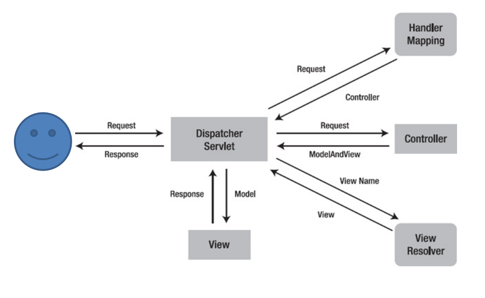

# SpringMVC的执行流程

- 用户发送请求到*前端控制器DispatcherServlet*
- DispatcherServlet收到请求调用*HandlerMapper处理映射器*
- 处理器映射器找到具体的处理器（可以根据xml配置、注解进行查找），生成处理器对象及处理器拦截器（如果有则生成）并返回给*DispatcherServlet*
- DispatcherServlet调用*HandlerAdapter处理器适配器*等
- HandlerAdapter经过适配器调用的*处理器（Controller，也叫后端控制器）*
- Controller执行完返回ModelAndView
- HandlerAdapter将Controller执行结果ModelAndView返回给*DispatcherServlet*
- DespatcherServlet将返回的ModelAndView传给*ViewReslover视图解析器*
- ViewReslover解析后返回具体的*View*
- DispatcherServlet根据View进行渲染视图（将模型数据填充到视图中）
- DispatcherServlet响应用户